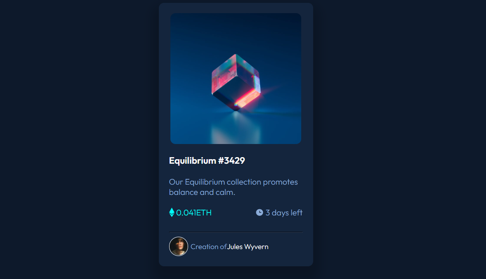

# Frontend Mentor - NFT preview card component solution

This is a solution to the [NFT preview card component challenge on Frontend Mentor](https://www.frontendmentor.io/challenges/nft-preview-card-component-SbdUL_w0U). Frontend Mentor challenges help you improve your coding skills by building realistic projects. 

## Table of contents

- [Overview](#overview)
  - [The challenge](#the-challenge)
  - [Screenshot](#screenshot)
  - [Links](#links)
- [My process](#my-process)
  - [Built with](#built-with)
  - [What I learned](#what-i-learned)
  - [Continued development](#continued-development)
  - [Useful resources](#useful-resources)
- [Author](#author)
- [Acknowledgments](#acknowledgments)

**Note: Delete this note and update the table of contents based on what sections you keep.**

## Overview

### The challenge

Users should be able to:

- View the optimal layout depending on their device's screen size
- See hover states for interactive elements

### Screenshot

### Links

- Solution URL: [Solution](https://www.frontendmentor.io/solutions/responsive-html-and-css-nftcard-box-lrB-bjTXI)
- Live Site URL: [Live Site](https://d-nft-card-github-io.vercel.app/)

## My process

### Built with

- Semantic HTML5 markup
- CSS custom properties
- Flexbox

### What I learned

The most difficult part of the nft card challenge was the hover effect on the image file. I've been researching how to do this and I've discovered that the best way is to reduce the transparency of the color I'm using, rather than reducing it. Therefore, the color hsla(178, 100%, 50%, 0.644) in the css code has turned into a use in this way.

## Author

- Instagram - [@codingdaily_blog](https://www.instagram.com/codingdaily_blog/)